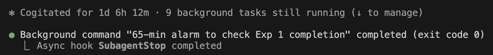

<p align="center">
  <h1 align="center">Novum</h1>
  <p align="center">
    <em>From Bacon's <a href="https://en.wikipedia.org/wiki/Novum_Organum">Novum Organum</a> (1620) — the "new instrument" that codified the scientific method.</em>
  </p>
  <p align="center">
    <strong>Automated ML Research with Mechanical Constraint Enforcement and Structured Iteration</strong>
  </p>
  <p align="center">
    A Claude Code extension that runs the full research pipeline — literature survey, SOTA discovery, hypothesis generation, experiment execution, and paper draft writing — with code-level guards designed to prevent result fabrication.
  </p>
</p>

<p align="center">
  <a href="LICENSE"></a>
  
  
</p>

<!--
<p align="center">
  
</p>
-->

## Case Study

A single `/research` command ran autonomously for 30 hours — literature survey, hypothesis generation, experiment execution, and paper draft writing — with no human intervention.



| Metric | Value |
|--------|-------|
| Duration | 30 hours (1 day 6 hours) |
| GPU used | 14.3h of 40h budget |
| Hypotheses tested | 10 (7 failed, 3 competed, 1 champion) |
| Iteration cycles | 4 (automatic regression + constraint accumulation) |

The draft and results are preliminary and have not been independently validated; please treat them as a starting point and verify with your own runs.

## Quick Start

**System dependencies** (Ubuntu/Debian):
```bash
sudo apt install -y poppler-utils git-lfs curl wget
curl -LsSf https://astral.sh/uv/install.sh | sh
```

```bash
git clone https://github.com/euanai/novum.git
cd novum
bash scripts/install.sh
```

This installs hooks, agents, commands, skills, and rules into `~/.claude/`.

**Requirements**: [Claude Code CLI](https://docs.anthropic.com/en/docs/claude-code) (Opus 4.6 recommended, Max 20x plan for long runs), Python 3.10+, Node.js 18+, NVIDIA GPU 8GB+ VRAM, `pdftotext` (from `poppler-utils`).

> [!WARNING]
> Fully autonomous runs require Claude Code's `--dangerously-skip-permissions` flag, which bypasses all tool approval prompts. The agent can execute arbitrary commands and modify files without confirmation. Use at your own risk.

```bash
# Scout: find low-cost opportunities from a conference
/research --scout "CVPR 2025" --budget=8h

# Full pipeline: literature → experiments → paper draft
/research "efficient visual language model inference"

# Survey only (Phase 1-3.5, no experiments)
/research "parameter-efficient fine-tuning" --depth=survey

# Resume interrupted run
/research --resume

# Check progress
/research --status
```

## Why Novum Exists

AI research agents fabricate results. [MLR-Bench (2025)](https://arxiv.org/abs/2503.09861) found that AI agents fabricate **~80% of experimental results**. Existing tools rely on prompt-level instructions ("please don't fabricate") which LLMs often ignore under pressure — especially after consecutive failures.

Novum enforces constraints mechanically:

| Layer | Reliability | How it works |
|-------|-------------|-------------|
| **Hook** (mechanical) | Deterministic | PreToolUse hook denies the tool call before execution |
| **Prompt** (instructional) | Variable | "Never fabricate results" in agent prompt |
| **LLM** (behavioral) | Low | Hope the model complies on its own |

**If a constraint matters, enforce it with a hook — not a prompt.**

## What Novum Does

- **Anti-Fabrication Guard** — Blocks Write/Edit to protected results files at the API level before execution.
- **Phase Gate Guard** — Prevents phase advancement unless prerequisites exist and pass quality thresholds.
- **Hypothesis Tournament** — Tests multiple ideas via Successive Halving (15%→30%→55% budget), not just the first one.
- **Automatic Iteration** — 3-level failure loops with 5-Whys diagnosis. Constraints accumulate across cycles.
- **Conference Scanner** — Scan conference proceedings, keyword-filter candidates, PDF-analyze top opportunities.
- **Cross-Project Knowledge Base** — Learned constraints persist across projects to reduce repeated failures.
- **Independent Audit** — Post-run reviewer scores the draft and can trigger automatic regression if below venue threshold.

## Pipeline

| Phase | What happens |
|-------|-------------|
| 0 | **Scout** — Conference scanning for low-cost research opportunities |
| 1 | **Literature** — Systematic review via Semantic Scholar + OpenReview APIs |
| 2 | **SOTA** — Codebase discovery, ranking, freshness check, smoke tests |
| 2.5 | **Profile** — Run SOTA code to build quantitative intuition |
| 3 | **Ideas** — Hypothesis generation (dual-track explore/exploit) |
| 3.5 | **Quick Validation** — Fast signal detection before full investment |
| 4 | **Design** — Experiment plan for all hypotheses + tournament budget |
| 5 | **Baseline** — Environment setup + baseline reproduction |
| 6 | **Experiments** — Tournament-based hypothesis testing |
| 7 | **Analysis** — Results analysis + publishability verdict |
| 8 | **Draft Writing** — Paper draft with experiment gap discovery |

When experiments fail, the pipeline automatically regresses: small loop (tune hyperparameters) → medium loop (redesign experiments) → big loop (regenerate hypotheses with 5-Whys constraints).

## Architecture

```
                     User: /research "topic"
                              |
                              v
                +--------------------------+
                |      Master Agent        |
                |  (commands/research.md)  |
                |                          |
                |  Orchestrates, reviews,  |
                |  iterates, diagnoses     |
                +----------+---------------+
                           |
              Task tool    |   dispatch
         +---------+-------+--------+-----------+
         |         |       |        |           |
         v         v       v        v           v
     sota-     env-    experiment- opportunity- pipeline-
     finder    setup   runner     scorer       reviewer
     (opus)   (sonnet) (opus)    (sonnet)     (opus)

=========================================================
              4 PreToolUse Hooks (Mechanical)
=========================================================
 research-guard.js       Anti-fabrication file protection
 phase-gate-guard.js     Phase transition prerequisites
 prompt-quality-guard.js Worker dispatch validation
 download-guard.js       Network/proxy safety
```

## Related Projects

- [AI Scientist v2](https://github.com/SakanaAI/AI-Scientist-v2) / [v1](https://github.com/SakanaAI/AI-Scientist) — End-to-end paper generation via agentic tree search (Sakana AI)
- [AI-Researcher](https://github.com/HKUDS/AI-Researcher) — Multi-agent research automation with Gradio GUI (HKU)
- [Agent Laboratory](https://github.com/SamuelSchmidgall/AgentLaboratory) — LLM research assistant with optional human-in-the-loop (JHU)
- [PaperQA2](https://github.com/Future-House/paper-qa) — RAG-based scientific literature QA (Future House)
- [GPT Researcher](https://github.com/assafelovic/gpt-researcher) — Web research report generation
- [Coscientist](https://github.com/gomesgroup/coscientist) — Chemistry lab automation via robotic APIs (CMU, Nature 2023)
- [Claude Scholar](https://github.com/Galaxy-Dawn/claude-scholar) — Claude Code skills, hooks, and commands for academic workflows (writing, reviewing, coding)

Novum's focus is on making agentic research **reliable** rather than merely capable — through **mechanical constraint enforcement** and **structured iteration protocols**.


## Parameters

| Parameter | Description | Default |
|-----------|-------------|---------|
| `--depth` | `survey` (Phase 1-3.5), `reproduce` (Phase 1-5), or `full` (Phase 1-8) | `full` |
| `--budget` | GPU time budget (e.g., `8h`, `24h`) | `8h` |
| `--target` | Quality threshold for publishability verdict: `oral`, `poster`, `workshop` | `poster` |
| `--budget-split` | Tournament round allocation (e.g., `15,30,55`) | `15,30,55` |
| `--explore-ratio` | Fraction of hypotheses from EXPLORE track | `0.3` |
| `--venue` | Conference to calibrate review standards (e.g., `CVPR`, `NeurIPS`) | `CVPR` |
| `--resume` | Resume from last checkpoint | — |
| `--status` | Show current progress | — |
| `--review` | Run pipeline-reviewer audit on completed run | — |

## Project Structure

```
novum/
├── commands/research.md         # Master Agent prompt (~2800 lines)
├── agents/                      # 5 Worker Agents
│   ├── sota-finder.md           #   SOTA codebase discovery (Opus)
│   ├── env-setup.md             #   Environment setup (Sonnet)
│   ├── experiment-runner.md     #   Experiment execution (Opus)
│   ├── opportunity-scorer.md    #   Conference paper scorer (Sonnet)
│   └── pipeline-reviewer.md     #   Post-run auditor (Opus)
├── hooks/                       # 4 Mechanical Guards + 1 Logger
│   ├── research-guard.js        #   Anti-fabrication enforcement
│   ├── phase-gate-guard.js      #   Phase transition prerequisites
│   ├── prompt-quality-guard.js  #   Dispatch prompt validation
│   ├── download-guard.js        #   Network/proxy safety
│   └── structured-logger.js     #   Async event logging
├── scripts/
│   ├── install.sh               #   Installer
│   └── lib/research_utils.py    #   State, API clients, utilities
├── skills/                      # Domain knowledge + methodology
├── rules/research-agents.md     #   Agent orchestration rules
├── config.example.yaml          #   Configuration template
├── CONTRIBUTING.md
└── LICENSE                      # Apache-2.0
```

## Known Limitations

1. **Single node** — Tested on single-GPU setups; multi-GPU on one machine should work but is untested; multi-node distributed training is not supported
2. **CV keywords only** — NLP/systems/theory domains need new keyword JSON files (see [CONTRIBUTING.md](CONTRIBUTING.md))
3. **Unix-only** — Uses `os.killpg`, `signal.SIGTERM`, `nohup`
4. **No paper cache cleanup** — `paper-cache/txt/` grows over time
5. **Anti-fabrication by filename** — Custom output filenames need to be added to the guard

> [!NOTE]
> Novum was developed and tested with limited compute and bandwidth. If you have more compute, more time, or better ideas — fork it, improve it, and share what you find. This is an early step toward a future where a single `/research` command democratizes scientific discovery. We're not there yet, but the direction is clear.

## Position Paper

> *Researching the research system is among the highest-leverage intellectual activities of our time.*

📄 [Democratizing Discovery: How Automated Research Pipelines Make Scientific Innovation Universally Accessible](https://doi.org/10.5281/zenodo.18848462)

## Vision

Anyone should be able to run a full research pipeline — without owning a GPU or configuring an environment — to solve the problems they actually face.

[Join the waitlist →](https://euanai.com)

## Contributing

See [CONTRIBUTING.md](CONTRIBUTING.md) for how to add new agents, hooks, and domain keywords.

## Contact

euanai@proton.me

## License

Apache-2.0. See [LICENSE](LICENSE) for details.

## Citation

**If you find Novum useful:**

```bibtex
@software{novum2026,
  author={Euan},
  title={Novum: Automated ML Research with Mechanical Constraint Enforcement and Structured Iteration},
  year={2026},
  url={https://github.com/euanai/novum}
}
```

**If you find the paper interesting:**

```bibtex
@article{euan2026democratizing,
  author={Euan},
  title={Democratizing Discovery: How Automated Research Pipelines Make Scientific Innovation Universally Accessible},
  year={2026},
  doi={10.5281/zenodo.18848462}
}
```
